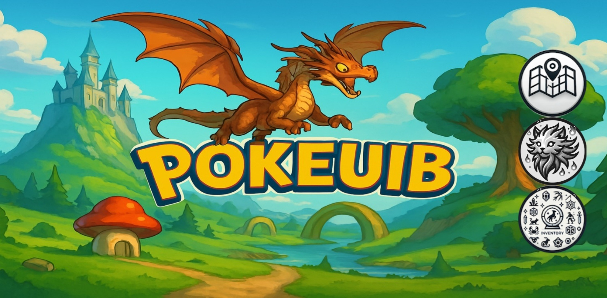
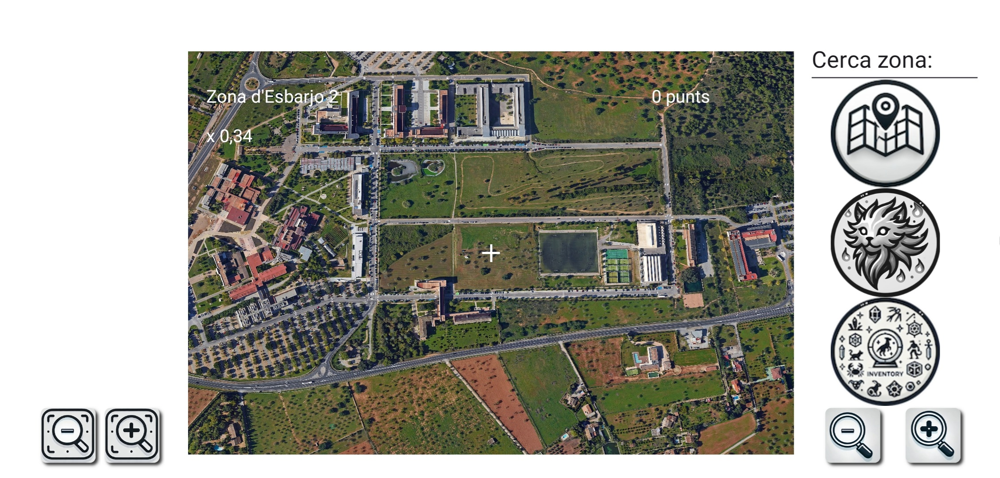
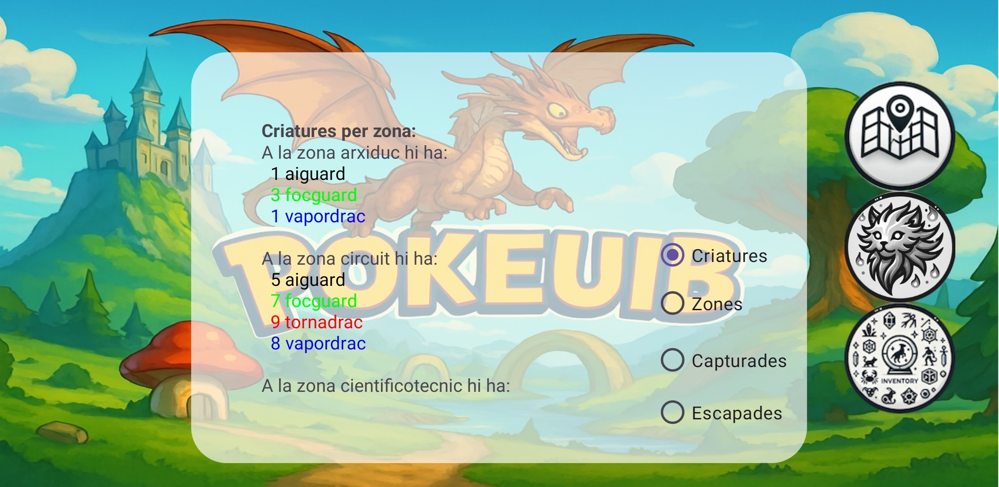
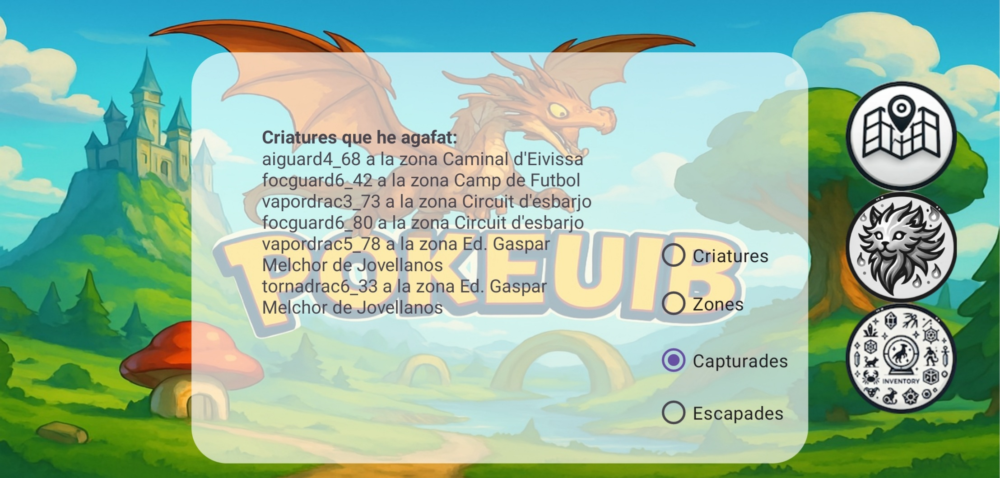
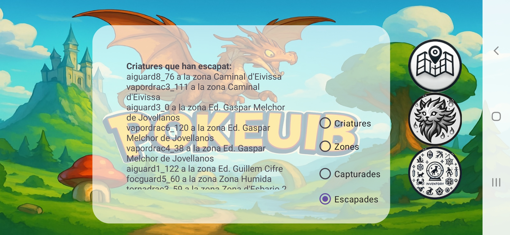
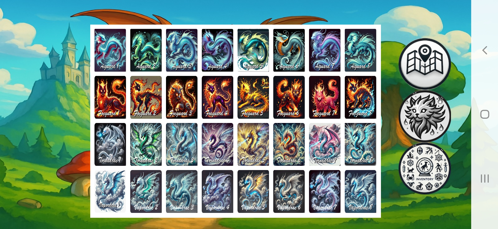
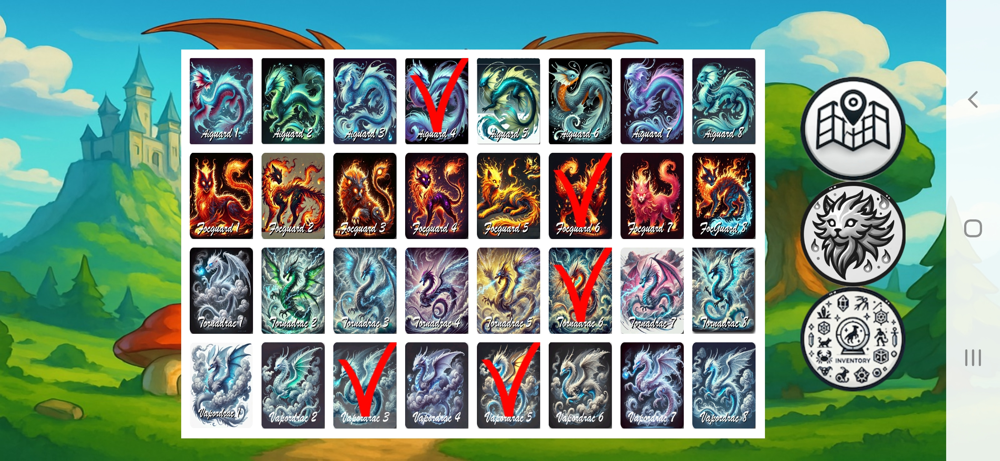

# 🐉 Poke UIB

  

## 📝 Project Overview 
**Poke-UIB** is a location-based interactive game developed for the **Algorithms and Data Structures II** course at the **University of the Balearic Islands (UIB)**. The project is based on a narrative where mythical creatures (*Vapordrac, Focguard, Tornadrac, and Aiguard*) have been rediscovered on campus through "arcane detection technology".

The main objective is to explore the campus, detect these creatures, and reach collaboration pacts with them through a mini-game.

---

## 🎮 Game Mechanics & Functionalities

### 1. Exploration and Detection
The game features a high-resolution map (6144x4096 px) of the UIB campus.
* **Zonal Division:** The map is divided into buildings and services (Jovellanos, Guillem Cifre, etc.).
* **Smart Sensor:** A reticle at the center of the screen tracks the player's position. It changes from a **white cross** to a **white circle** when creatures are within detection range.
* **Visibility Factors:** Each genre has a specific detection distance and movement speed, requiring players to use zoom controls effectively.

  

### 2. The Capture Mini-Game (The Pact)
When a collision occurs between the player and a creature, a "Rock, Paper, Scissors" challenge begins.
* **Win:** The creature is added to your **Captured Inventory** and you gain points.
* **Loss:** The creature escapes and is logged in the **Escaped History**.
* **Draw:** The round is repeated until a winner is decided.

### 3. Real-Time Data Visualization
The application provides detailed reports of the campus ecosystem:
* **Creatures per Zone:** Count of active creatures by genre.
* **Map Zones:** Official names and bounding box coordinates.
* **Interaction Logs:** Detailed lists of every creature captured or escaped.

  
  
  

---

## 🛠️ Technical Implementation: Architecture & Files

### 1. `MainActivity.java` (The Engine)
This is the core of the application. It handles:
* **Canvas Rendering:** Using `SurfaceView` to draw the map and entities dynamically.
* **Touch Logic:** Implementation of `ScaleGestureDetector` for pinch-to-zoom and dragging mechanics.
* **Procedural Spawning:** An algorithm that generates 500 initial creatures and distributes them randomly across valid zones defined in JSON.
* **UI State Management:** Efficiently toggling visibility for over 15 different `View` components using custom Sets.

### 2. Data Files and Assets
* **`zones.json`**: Defines the spatial grid of the campus. Each zone contains a popular name (for search), official name, and coordinates (`x1, y1` to `x2, y2`).
* **Creature Sprites:** 32 unique species (8 variants per genre) used for the inventory and capture dialogs.

  
  

---

## 🧠 Advanced Data Structures
The project strictly follows academic requirements to optimize memory and computational cost:

* **Custom Sets (`UnsortedArraySet` / `UnsortedLinkedListSet`):** - Used to store UI `View` elements for bulk operations.
    - Used to manage sets of creatures within each zone to ensure no duplicates.
* **Mappings (Dictionaries):** - **`critPerZona`**: A nested `HashMap<String, TreeMap<String, HashSet<Criatures>>>` that links zones to their respective creature types.
    - **`nomsOficials`**: Translates user search queries to official building names.
    - **Attribute Maps**: Store genre-specific constants (points, speed, colors).
* **Iterators:** All custom collections implement the `Iterator` interface for clean and efficient $O(N)$ traversal during rendering loops.

---

## 📂 File Structure
* `app/src/main/java/`: Logic for Sets, the `Criatures` model, and `MainActivity`.
* `app/src/main/res/raw/`: External data (`zones.json`).
* `app/src/main/res/drawable/`: High-res map and species sprites.
* `app/src/main/res/layout/`: XML designs for the main interface and capture dialogs.

---

*Project developed for the Computer Engineering degree at UIB (2024-25)*.
